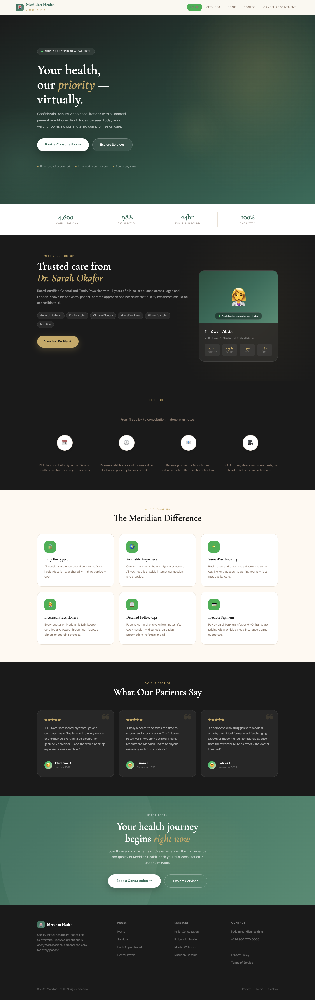
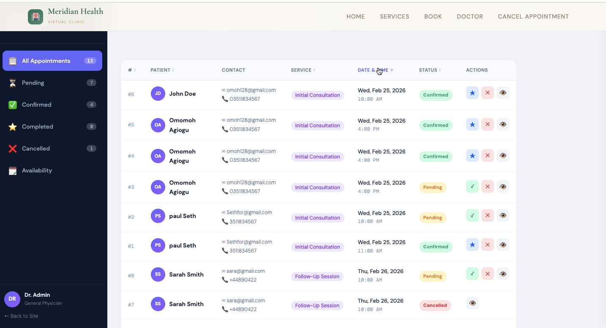

🏥 Meridian Health — Virtual Clinic

Meridian Health is a modern, secure virtual healthcare platform designed to connect patients with licensed practitioners through a seamless and intuitive digital experience.

Built with performance, security, and user trust in mind, the platform delivers a clean clinical interface and a streamlined consultation workflow.

✨ Overview

Meridian Health enables:

Remote consultations with real doctors
Simple appointment scheduling
Centralized patient management
Secure medical documentation

💡 Designed to feel like a premium digital clinic — fast, minimal, and trustworthy.

📸 UI Preview
🏠 Landing Page

📅 Booking Flow

📊 Patient Dashboard

🎥 Video Consultation

📄 Medical Report / Follow-up

 Core Features
 Secure Video Consultations
End-to-end encrypted sessions
Real-time communication with licensed doctors
Smart Booking System

A clean 4-step process:

Service → Time → Confirmation → Session
Patient Dashboard
View upcoming appointments
Manage sessions
Track medical history
Digital Follow-ups
Diagnoses
Prescriptions
Doctor recommendations
 Technical Highlights
 High-performance frontend powered by Vue.js 3
Backend security handled with Laravel
Clean UI/UX with custom design system
Modular and scalable architecture
Tech Stack
Layer	Technology
Backend	Laravel 12.52.0
Frontend	Vue.js 3
Build Tool	Vite
Database	MySQL
Styling	Custom CSS
Typography
Cormorant Garamond → Elegant clinical headings
DM Sans → Clean and readable UI
⚙️ Local Setup
1. Clone Repository
git clone https://github.com/omomohagiogu/meridian.git
cd meridian
2. Install Dependencies
composer install
npm install
3. Configure Environment
cp .env.example .env
php artisan key:generate

Update your .env with database credentials (MySQL/XAMPP recommended)

4. Run Migrations
php artisan migrate --seed
5. Compile Assets
npm run dev

7. Start Server
php artisan serve
🧪 Production Build
npm run build
<<<<<<< HEAD
>>>>>>> edit readme file
### 🖥️ Dashboard Overview

**Patient Booking View:**

**Doctor Appointment Management:**

